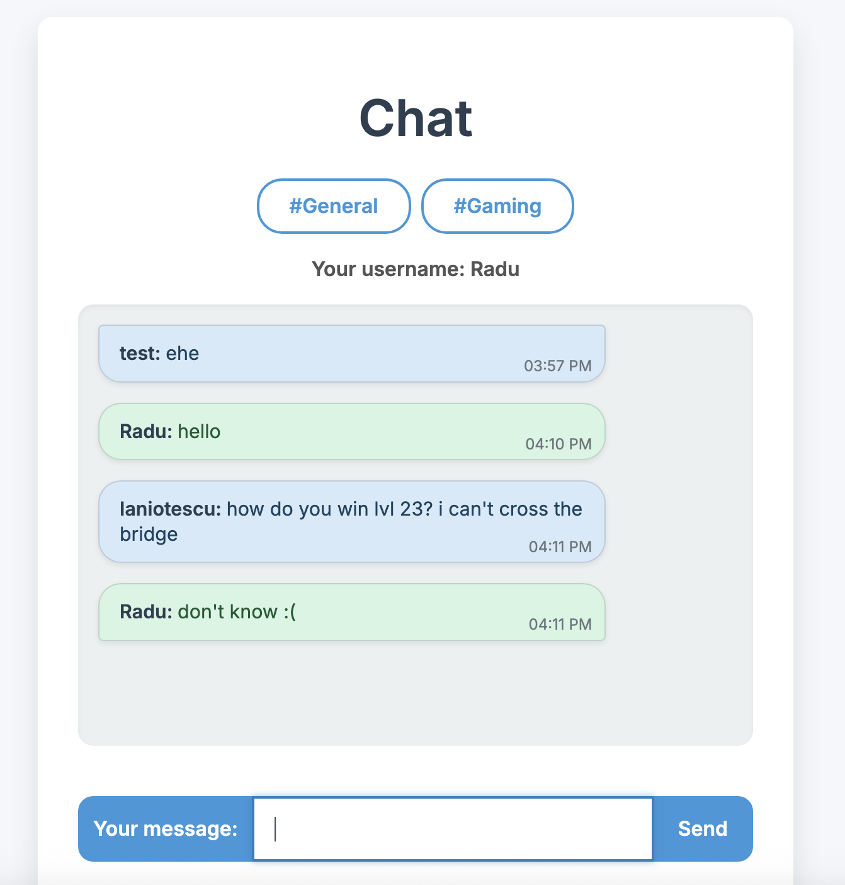
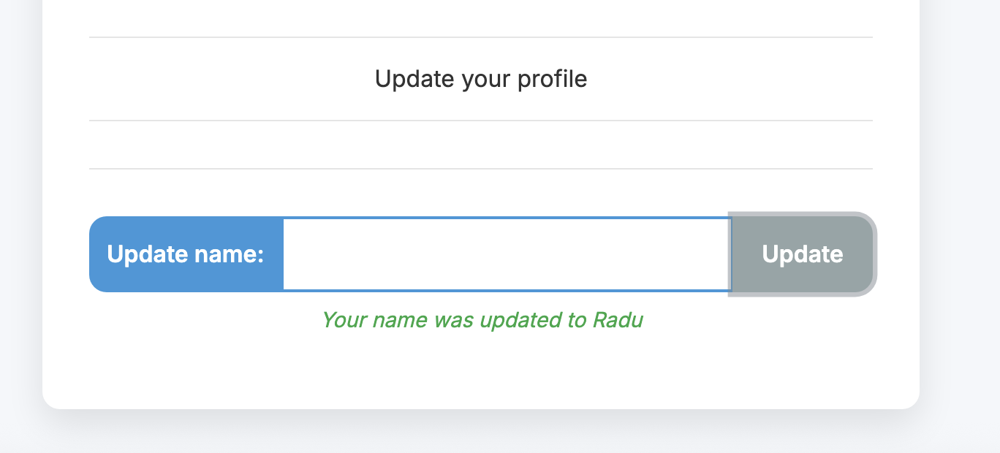

# Real-time chatroom

A real-time chatroom built with Firebase Firestore and plain JavaScript.

## Features

- Multiple chat rooms
- Real-time updates using Firestore
- Clear room messages
- Change display username

## Tech Stack

- Firebase Firestore
- Vanilla JavaScript
- Bootstrap

## Setup

1. Clone the repo
2. Run `npm install`
3. Create a Firebase project
4. Add your Firebase config to `scripts/firebase.js` (this file is ignored in Git)
5. Run `live-server`
